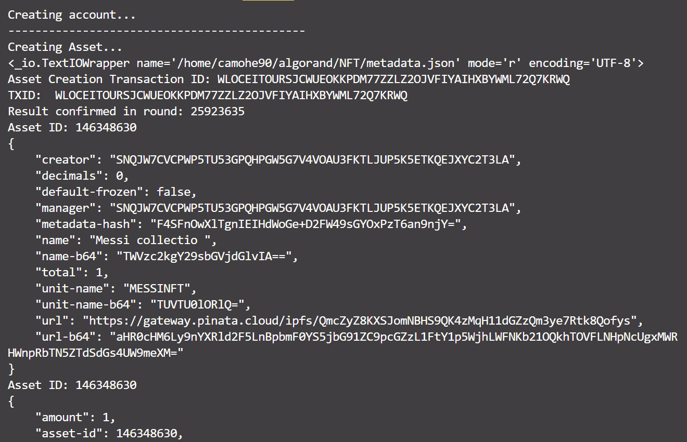
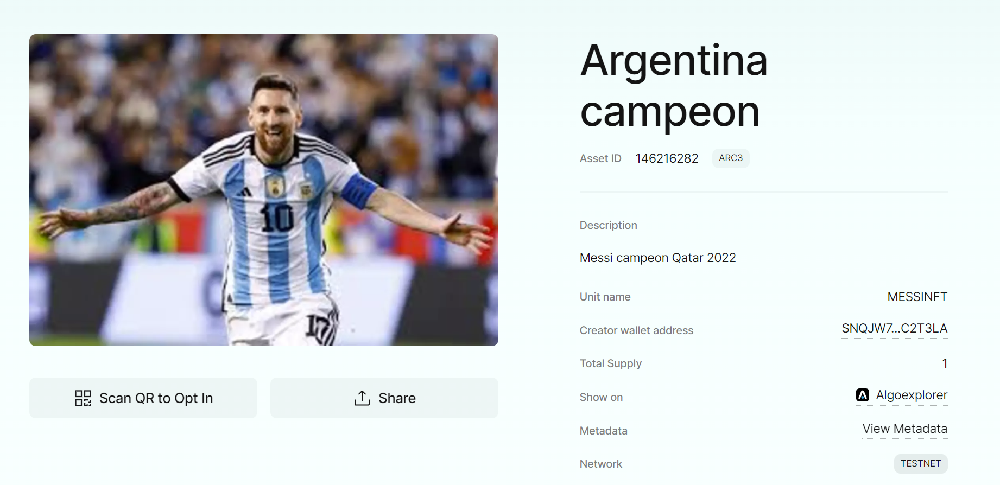

# Crear tu primer NFT en Algorand

En este repositorio vamos usar el SDK de python de algorand para crear nuestro primer NFT en la Testnet.


## Prerequisitos

Por favor instale o tenga instalado lo siguiente:

- [python](https://www.python.org/downloads/)

## Tareas necesarias

Antes de crear nuestro NFT debemos realizar los siguientes pasos:

1. [Instalar sdk python](https://github.com/algorand/py-algorand-sdk), al ejecutar el siguiente comando procederemos con la instalación.

```bash
pip install py-algorand-sdk 
```

2. Crear una cuenta

Vamos usar el SDK para crear una nueva cuenta, para ello simplemente debemos ejecutar el comando

```bash
python create_account.py
```

Obtendremos un resultado como el siguiente


Ahora solo resta fondear la cuenta con el [Algo Dispenser](https://dispenser.testnet.aws.algodev.network/)

3. Crear archivo de variables de entorno

Puedes agregar tus variables de entorno en el archivo `.env`, reemplazando los datos de acuerdo a los que te arroje el script create_account.py, este proceso se debe realizar solamente una vez:

```
MY_ADDRESS= ""
PRIVATE_KEY= ""
PASSPHRASE= ""
```
Para poder usar la información de nuestro archivo `.env` debemos instalar la siguiente dependencia.

```bash
pip install python-dotenv
```

## Ahora si ya estamos listos 

1. Debes subir la imagen que quieres que acompañe el NFT a tu servicio IPFS preferido, en este caso vamos a usar [Pinata](https://www.pinata.cloud/)

2. Una vez realizado el paso anterior debemos usar la URL de la imagen para agregarla a nuestro archivo `metadata.json` en el campo image.


3. En el campo image-integrity del archivo `metadata.json` debemos agregar el hash de la imagen, que corresponde a la información que se encuentra en la URL de la imagen despues de `/ipfs/`

4. Ahora debemos subir el archivo `metadata.json` a Pinata

5. Finalmente en el archivo `nft.py` en la linea 65 y 66 debemos agregar el unit_name y asset_name, así como en la linea 72 debemos agregar la url del archivo `metadata.json` que acabamos de subir a Pinta.

6. Ahora simplemente debemos guardar los cambios y ejecutar el script `nft.py`, si todo funciono correctamente deberiamos ver en la terminal un salida similar a la siguiente image.




## ¿Comó valido si todo funcionó?

1. Ahora simplemente debes ingresar a [Pera Explorer Testnet](https://testnet.explorer.perawallet.app/)

2. Ingresar el token ID, para el ejemplo seria: 146216282

3. Obtendriamos una imagen como la que se aprecia a continuación




## Recursos

Para empezar con Algorand te aconsejamos los siguiente recursos:

* [Documentación Algorand](https://developer.algorand.org/)


## Licencia

This project is licensed under the [MIT license](LICENSE).
