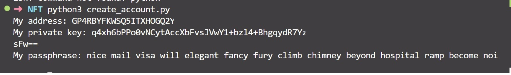

# Crear tu primer NFT en Algorand

En este repositorio vamos usar el SDK de python de algorand para crear nuestro primer NFT en la Testnet.


## Prerequisitos

Por favor instale o tenga instalado lo siguiente:

- [python](https://www.python.org/downloads/)

## Instalación

1. [Instalar sdk python](https://github.com/algorand/py-algorand-sdk), al ejecutar el siguiente comando procederemos con la instalación.

```bash
pip install py-algorand-sdk 
```

2. Crear una cuenta

Vamos usar el SDK para crear una nueva cuenta, para ello simplemente debemos ejecutar el comando

```bash
python create_account.py
```

Obtendremos un resultado como el siguiente



Ahora solo resta fondear la cuenta con el [Algo Dispenser](https://dispenser.testnet.aws.algodev.network/)

3. Crear archivo de variables de entorno

Puedes agregar tus variables de entorno en el archivo `.env, reemplazando los datos de acuerdo a los que te arroje el script create_account.py, este proceso se debe realizar solamente una vez:

```
MY_ADDRESS= ""
PRIVATE_KEY= ""
PASSPHRASE= ""
```
Para poder usar la información de nuestro archivo `.env` debemos instalar la siguiente dependencia.

```bash
pip install python-dotenv
```


## Ahora si ya estamos listos 

Ahora simplemente debes ingresar a [Pera Explorer Testnet](https://testnet.explorer.perawallet.app/)


## Recursos

Para empezar con brownie:

* [Documentación Algorand](https://developer.algorand.org/)


## Licencia

This project is licensed under the [MIT license](LICENSE).
